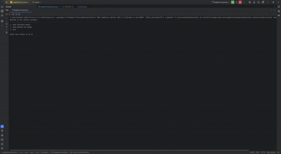

# Neighborhood Library

## Description of the Project

This console application display books that can be checked out to different people, and offers the option to check in books.
It is created to eliminate the need to find books, and keeping records on who checked out on any book.

## User Stories

- As a user, I want to be able to provide input, so that the application can take the input and act accordingly.
- As a user, I want to receive immediate feedback, so I can understand what to do next.

## Setup

Instructions on how to set up and run the project using IntelliJ IDEA.

### Prerequisites

- IntelliJ IDEA: Ensure you have IntelliJ IDEA installed, which you can download from [here](https://www.jetbrains.com/idea/download/).
- Java SDK: Make sure Java SDK is installed and configured in IntelliJ.

### Running the Application in IntelliJ

Follow these steps to get your application running within IntelliJ IDEA:

1. Open IntelliJ IDEA.
2. Select "Open" and navigate to the directory where you cloned or downloaded the project.
3. After the project opens, wait for IntelliJ to index the files and set up the project.
4. Find the main class with the `public static void main(String[] args)` method.
5. Right-click on the file and select 'Run 'YourMainClassName.main()'' to start the application.

## Technologies Used

- Java: JDK Amazon Corretto-17

## Demo

## Future Work

Outline potential future enhancements or functionalities you might consider adding:

- Implementing a database to store books.
- Improvement of current functionalities.

## Team Members

- **Andy Wu** - Owner

## Thanks

- Thank you, Raymond Maroun for continuous support and guidance.
- A special thanks to all teammates for their dedication and teamwork.
